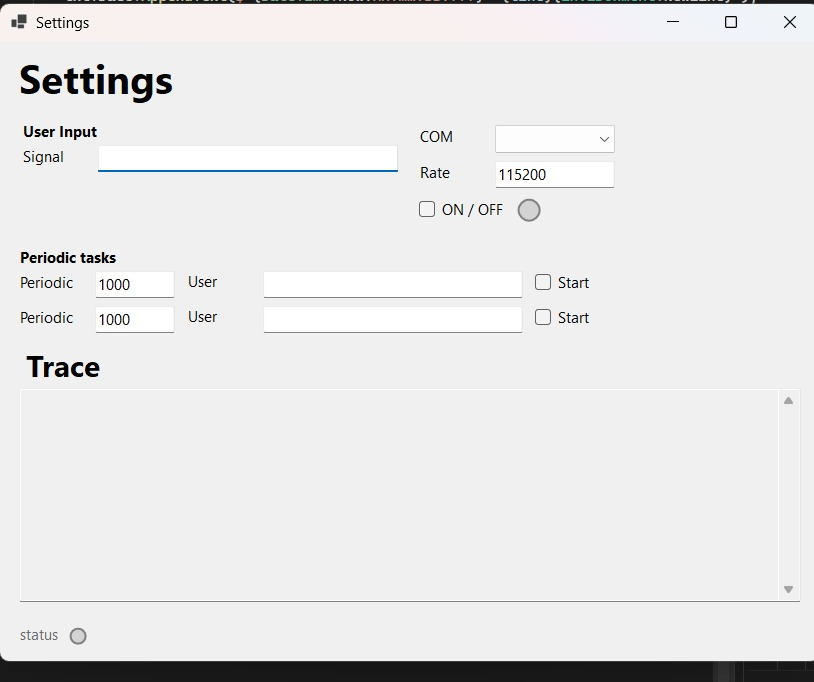
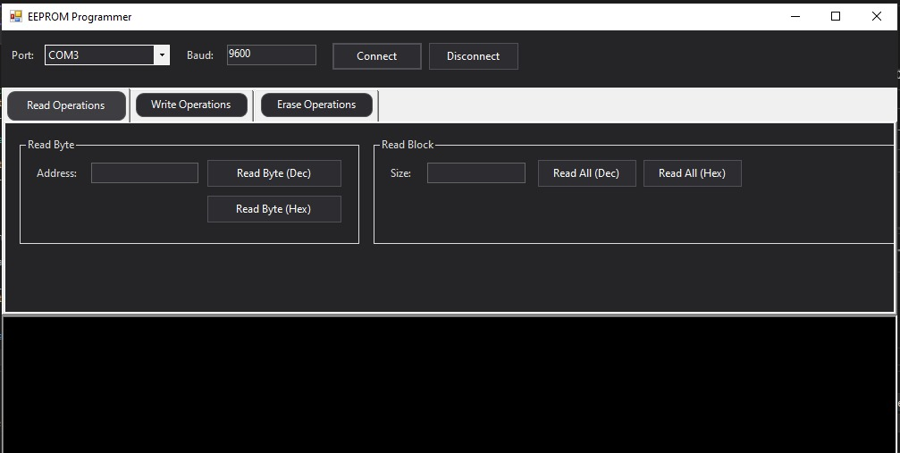
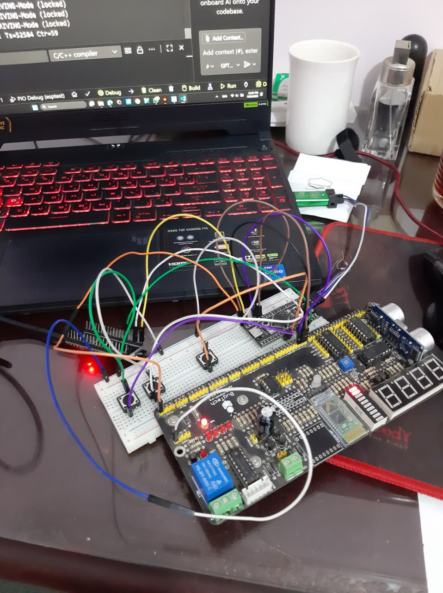

## E-mobility Seat Controller Project


## The **Seat Controller** Project is designed to make car seat adjustment easier and more comfortable by controlling the **height, distance, and incline**.  

At its core, the system uses an **STM microcontroller** as the master, running **FreeRTOS** and an **RTE (Runtime Environment)** to manage real-time events.  
It supports different tasks such as:
- **Manual Mode**: Adjust seat directly via control switches.  
- **Automatic Mode**: Take a default profile from EEPROM. 
- **Driving Mode**: User can't adjust seat while driving. 
- **Mode Manager / Switch**: Handles transitions between manual and automatic modes. 
- **I2C**: Used to transmit signals to the Bridge and the EEProm at the specified time and they occur with low priority.  

Additional MCUs:  
- **ESP32 Bridge ("Bus Sniffer")**: Communicates between STM and the external application via **I2C**.  
- **Arduino acts as EEPROM**: Connects to the STM via **I2C** to handle data persistence, supporting:  
  - Read/Write Byte  
  - Read All hexa/decimal Bits  
  - Write All starting from 0 
  - Write All using range of addresses
  - Erase All
  - Add Binary file to write to EEPROM

This design enables **real-time responsiveness**, **persistent storage**, and **flexible operation** modes compared to basic seat controllers.

## Desktop Applications GUI

### Bus Sniffer Application
The Bus Sniffer application provides a real-time interface for monitoring and controlling the seat controller system via I2C communication with the Bridge Arduino.



### EEPROM Simulator Application  
The EEPROM Simulator application offers a comprehensive interface for reading, writing, and erasing data stored in the EEPROM module via I2C communication.



## Hardware Setup

The project includes a comprehensive hardware demonstration setup featuring the complete seat controller ecosystem:



The setup showcases:
- **STM32 Development Board**: Running FreeRTOS for real-time seat control operations
- **ESP32 Bridge Module**: Acting as I2C communication bridge between STM and I2C Bus Sniffer application
- **Arduino UNO EEPROM Simulator**: Handling persistent data storage for seat profiles and fault logs
- **Breadboard Connections**: Demonstrating I2C communication lines and control interfaces
- **LED Indicators**: Providing visual feedback for system status and operational modes
- **Control Switches**: Enabling manual seat adjustment testing

This hardware setup validates the complete system integration, allowing real-time testing of:
- Seat adjustment modes
- I2C communication between all modules

## Installation
1. Clone the repository:
   ```bash
   git clone https://gitlab.com/meetup_group-e-mobility/seat_controller_ecu.git
   cd seat-controller
2. Flash STM firmware using STM32CubeProgrammer.
3. Upload Arduino sketches (EEPROM) using Arduino IDE.
4. Upload ESP32 sketch (Bridge) using Arduino IDE.
5. Connect hardware according to the wiring diagram included in the visuals.
6. Launch the application to communicate with the system.

## Requirements
1. STM32 microcontroller (FreeRTOS + RTE)
2. ESP 32 (Bridge – I2C)
3. Arduino UNO (EEPROM – I2C)
4. Companion PC/mobile application
5. Visual Studio Code with C# extension and Arduino IDE for Application and Arduino

## Usage
The STM communicates with the Bridge ESP32, which forwards messages to the application.
STM → Bridge Commands
1. Alive Message:
Sent periodically with:
Timestamp/ Counter

2. Target Commands:
Sent once per change:
Seat height target/ Incline target/ Slide target

3. Periodic Updates:
Current values of: 
Height/ Incline/ Slide

4. Control Request:
Command to adjust the three seat parameters to new requested values.

5. Fault Messages (Fault 1, Fault 2):
Sent once upon fault detection. Includes diagnostic data, which is also stored in EEPROM for later retrieval including the error source (eg, out of range, time ran out)

The EEPROM is used to include each value in its specified byte or range of bits such as: 
WA 0x20 - 3 - 10 **Writes 10 starting from 0x20 for 3 bytes**


## Roadmap
- Add **safety features** (e.g. failsafe handling).  
- Implement **diagnostic log manager** for error/fault tracking.  
- Integrate **CAN bus support** for compatibility with modern automotive networks.  
- Create **comprehensive unit tests** and hardware-in-the-loop testing setup.  


## Authors and acknowledgment
- **[Moatasem Osama]** – Project Manager & Lead Developer  
- **[Ahmad Yasser]** - Responsible for communication protocols, RTE and FreeArtos
- **[Amr Yasser]** - Developed GUI for the Applications 
- **[Noreen Adham]** - Developing backend/frontend for the EEPROM aaplication using C#
- **[Karen Hany]** - Developing backend/frontend for the bus sniffer aaplication using C#
- **[Haneen Nabil]** - Developed Arduino IDE code and Hardware for the Stm > Bridge Application
